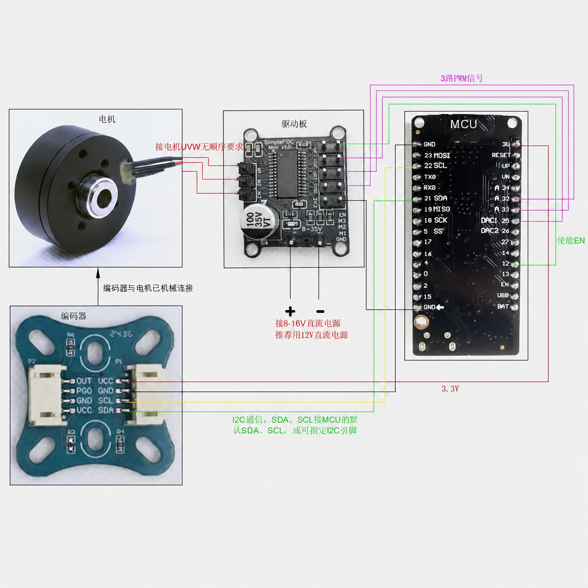
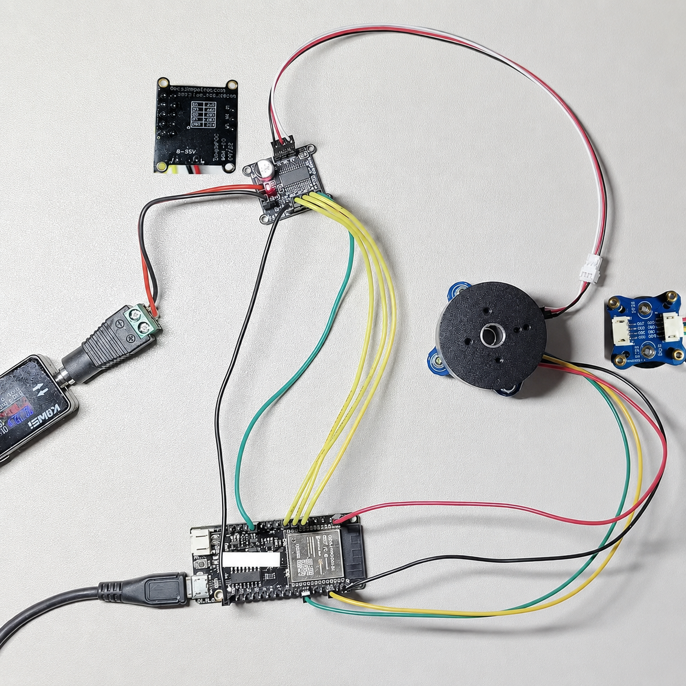

# ESP32 BLDC Motor Control with SimpleFOC

[中文说明](./README.zh-CN.md)

An ESP32-based BLDC motor control project using SimpleFOC, a SimpleFOC mini 3PWM driver board, a 2804 gimbal motor,and an AS5600 magnetic encoder.

This repository documents a small but complete motor-control bring-up workflow: sensor validation, open-loop motor testing,and closed-loop velocity control.



## Project Highlights

- ESP32 motor-control bring-up with Arduino / PlatformIO
- AS5600 I2C magnetic encoder angle and velocity feedback
- SimpleFOC 3PWM BLDC driver integration
- Open-loop and closed-loop velocity control examples
- Serial command interface for target velocity and voltage-limit tuning
- Hardware wiring, BOM, and troubleshooting notes included for reproducibility

## Hardware

| Item | Description |
|---|---|
| MCU | DOIT ESP32 DevKit V1 / ESP32 Dev Module |
| Motor | 2804 BLDC gimbal motor, 7 pole pairs |
| Encoder | AS5600 I2C magnetic encoder module |
| Driver | SimpleFOC mini v1.0 3PWM BLDC driver board |
| Power Supply | 12V DC power supply, at least 2A recommended |



## Repository Structure

| Path | Purpose |
|---|---|
| `V1_01_AS5600_Sensor_Test/` | Validate AS5600 angle and velocity readings |
| `V1_02_2804_OpenLoop_Test/` | Test 2804 motor rotation without encoder feedback |
| `V1_03_ClosedLoop_Velocity_Test/` | Run closed-loop velocity control with AS5600 feedback |
| `platformio.ini` | PlatformIO build environments for the three sketches |
| `BOM.md` | Bill of materials |
| `DEPENDENCIES.md` | Arduino / ESP32 / SimpleFOC dependency notes |
| `TROUBLESHOOTING.md` | Common bring-up issues and checks |
| `docs/` | Wiring and setup images |

## Wiring

### AS5600 To ESP32

| AS5600 | ESP32 |
|---|---|
| VCC | 3.3V |
| GND | GND |
| SDA | GPIO21 |
| SCL | GPIO22 |

### SimpleFOC Mini To ESP32

| SimpleFOC mini | ESP32 |
|---|---|
| IN1 | GPIO32 |
| IN2 | GPIO33 |
| IN3 | GPIO25 |
| EN | GPIO12 |
| GND | GND |

### Power

- ESP32 is powered through USB.
- SimpleFOC mini is powered by an external 12V DC supply.
- ESP32 GND, SimpleFOC mini GND, and the power supply negative terminal must share a common ground.

## Safety Notes

- Keep the motor unloaded and firmly mounted during testing.
- Do not touch the motor shaft, phase wires, or driver board while the motor is running.
- Start with a low voltage limit and low target velocity.
- For the AS5600-only test, do not power the motor driver.
- Stop the test immediately if the motor or driver becomes hot.

## Test Workflow

1. Upload `V1_01_AS5600_Sensor_Test`.
2. Open Serial Monitor at `115200` baud.
3. Rotate the motor rotor by hand and verify that angle and velocity change.
4. Upload `V1_02_2804_OpenLoop_Test`.
5. Use serial commands to verify forward rotation, stop, and reverse rotation.
6. Upload `V1_03_ClosedLoop_Velocity_Test`.
7. Run `initFOC()` and verify closed-loop velocity control.

## Serial Commands

| Command | Meaning |
|---|---|
| `T3` | Slow forward rotation, mainly for closed-loop testing |
| `T6.28` | Forward rotation at about 1 rotation/s |
| `T0` | Stop |
| `T-6.28` | Reverse rotation at about 1 rotation/s |
| `L4` | Set motor voltage limit to 4V |
| `L5` | Set motor voltage limit to 5V |

## PlatformIO

This project includes three PlatformIO environments:

| Environment | Sketch |
|---|---|
| `sensor_test` | `V1_01_AS5600_Sensor_Test` |
| `openloop_test` | `V1_02_2804_OpenLoop_Test` |
| `closedloop_velocity_test` | `V1_03_ClosedLoop_Velocity_Test` |

Build example:

```bash
pio run -e sensor_test
```

Upload example:

```bash
pio run -e closedloop_velocity_test -t upload
```

Serial monitor:

```bash
pio device monitor -b 115200
```

## Verified Results

- AS5600 angle and velocity readings work correctly.
- Open-loop forward rotation, stop, and reverse rotation work correctly.
- Closed-loop velocity control forward rotation, stop, and reverse rotation work correctly.
- Closed-loop `initFOC()` completed with sensor alignment and pole-pair check OK.
- Current sensing is not used in this setup; the `No current sense` message in the log is expected.

## Demo And Logs

- [Motor demo video](./docs/demo.mp4)
- [Closed-loop serial log](./docs/closedloop-serial-log.txt)

## Documentation

- [BOM](./BOM.md)
- [Dependencies](./DEPENDENCIES.md)
- [Troubleshooting](./TROUBLESHOOTING.md)

## License

This project is released under the [MIT License](./LICENSE).
